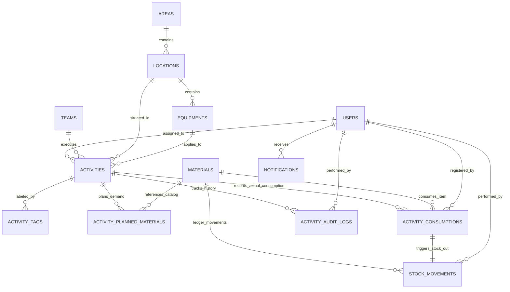

# Proposta de Modelo de Dados Relacional (PostgreSQL / Supabase)

Este documento apresenta a especificação consolidada do modelo de dados para a transição da versão atual (V1 Mock) para a persistência real no PostgreSQL / Supabase, incorporando as decisões arquiteturais e operacionais aprovadas para o **Sistema de Pintura Industrial** e respeitando integralmente as regras do [AGENTS.md](../../AGENTS.md).

---

## 1. Visão Geral da Modelagem e Decisões Aprovadas

1. **Unicidade e Imutabilidade da Atividade:** A atividade é identificada exclusivamente pela sua **Nota** (`order_number`). Transições de ciclo de vida (programada, andamento, concluída, cancelada, reprogramada) operam sobre o mesmo registro, sem duplicação de dados.
2. **Kardex como Fonte da Verdade do Estoque:**
   - A tabela `stock_movements` é o livro-razão imutável de todas as entradas, saídas por consumo, perdas e ajustes.
   - O campo de saldo em `materials.current_stock` funciona como cache transacional de performance, estritamente derivado dos registros de movimentação. Nenhuma alteração arbitrária de saldo é permitida sem uma movimentação associada.
3. **Baixa Atômica de Consumo:**
   - O apontamento de consumo real em campo dispara a baixa de estoque na mesma transação ACID:
     $$\text{Apontamento de Consumo} \rightarrow \text{Baixa em Estoque} \rightarrow \text{Registro no Kardex} \rightarrow \text{Log de Auditoria}$$
   - Se qualquer etapa falhar, toda a operação sofre `ROLLBACK`.
4. **Planejamento de Demanda Sem Bloqueio (Sem Reserva Formal):**
   - Materiais planejados em atividades representam estimativa de demanda operacional, sem realizar retenção ou bloqueio do saldo físico em estoque.
   - As necessidades são apuradas analiticamente por períodos (Necessidade da Semana vs. Necessidade do Mês).
5. **Ciclo de Vida Simplificado de Status:**
   - Status unificados: `'programada'`, `'em_andamento'`, `'pausada'`, `'concluida'`, `'cancelada'` (o status redundante `'planejada'` foi removido).
   - Fluxo determinístico por avanço físico:
     - $0\% \rightarrow \text{programada}$
     - $>0\% \text{ e } <100\% \rightarrow \text{em\_andamento}$
     - $100\% \rightarrow \text{concluida}$
     - Cancelamento $\rightarrow \text{cancelada}$ (exige justificativa obrigatória).
6. **Lotes e Fracionamento Simples na V1:**
   - Sem controle avançado de fracionamento de latas abertas ou múltiplos lotes por linha de saldo nesta fase. Campos básicos de lote e validade no material atendem à rastreabilidade padrão da V1.
7. **Usuários e Autenticação Futura:**
   - Estrutura de autoria e auditoria vinculada à tabela `users`, compatível com migração futura para o `auth.users` do Supabase quando a autenticação for autorizada.

---

## 2. Diagrama Conceitual de Relacionamentos (ERD)



---

## 3. Especificação das Entidades e Dicionário de Dados

### 3.1. Estrutura Organizacional e Localização

#### `areas` (Áreas Operacionais)
- `id` (UUID, PK, `gen_random_uuid()`): Identificador único.
- `name` (VARCHAR(100), UNIQUE, NOT NULL): Nome da área (ex: "Pintura Industrial").
- `code` (VARCHAR(20), UNIQUE, NOT NULL): Código de identificação (ex: "PINT").
- `active` (BOOLEAN, NOT NULL, DEFAULT true): Flag de inativação (soft delete).
- `created_at` (TIMESTAMPTZ, NOT NULL, DEFAULT now()).

#### `locations` (Locais de Aplicação)
- `id` (UUID, PK, `gen_random_uuid()`).
- `area_id` (UUID, FK `areas.id`, NOT NULL).
- `name` (VARCHAR(150), NOT NULL): Nome do local (ex: "Pátio de Tanques", "Linha Principal").
- `created_at` (TIMESTAMPTZ, NOT NULL, DEFAULT now()).
- *Constraint de Unicidade:* `UNIQUE(area_id, name)`.

#### `equipments` (Equipamentos e Estruturas Físicas)
- `id` (UUID, PK, `gen_random_uuid()`).
- `location_id` (UUID, FK `locations.id`, NOT NULL).
- `name` (VARCHAR(150), NOT NULL): Identificação do ativo (ex: "Tanque T-01", "Caldeira B").
- `created_at` (TIMESTAMPTZ, NOT NULL, DEFAULT now()).

---

### 3.2. Usuários e Equipes

#### `users` (Usuários / Operadores / Coordenadores)
*Preparado para vincular com `auth.users` do Supabase no momento oportuno.*
- `id` (UUID, PK, `gen_random_uuid()`).
- `full_name` (VARCHAR(150), NOT NULL): Nome do profissional.
- `email` (VARCHAR(150), UNIQUE, NULL): E-mail institucional.
- `role` (VARCHAR(50), NOT NULL, DEFAULT 'operador'): Papel (`'coordenador'`, `'inspetor'`, `'operador'`).
- `active` (BOOLEAN, NOT NULL, DEFAULT true).
- `created_at` (TIMESTAMPTZ, NOT NULL, DEFAULT now()).

#### `teams` (Equipes de Execução)
- `id` (UUID, PK, `gen_random_uuid()`).
- `name` (VARCHAR(100), UNIQUE, NOT NULL): Nome da equipe (ex: "Equipe Alfa - Pintura Pesada").
- `leader_id` (UUID, FK `users.id`, NULL): Encarregado responsável.
- `active` (BOOLEAN, NOT NULL, DEFAULT true).
- `created_at` (TIMESTAMPTZ, NOT NULL, DEFAULT now()).

---

### 3.3. Módulo de Atividades

#### `activities` (Ordens de Serviço e Atividades)
Entidade central imutável em identificação.
- `id` (UUID, PK, `gen_random_uuid()`).
- `order_number` (VARCHAR(50), UNIQUE, NOT NULL): **Nota / Identificador Imutável** (ex: "OS-2026-101").
- `name` (VARCHAR(255), NOT NULL): Nome descritivo da atividade.
- `service_type` (VARCHAR(100), NOT NULL): Categoria técnica (ex: "Pintura Epóxi", "Jateamento Sa 2 ½").
- `description` (TEXT, NOT NULL): Procedimento / escopo técnico.
- `origin_reference` (VARCHAR(150), NULL): Referência de origem (relatório de inspeção, chamado).
- `area_id` (UUID, FK `areas.id`, NOT NULL).
- `location_id` (UUID, FK `locations.id`, NOT NULL).
- `equipment_id` (UUID, FK `equipments.id`, NULL).
- `custom_location_text` (VARCHAR(255), NULL): Descrição quando selecionada opção "Outro".
- `status` (VARCHAR(30), NOT NULL, DEFAULT 'programada'):
  - Valores aceitos: `'programada'`, `'em_andamento'`, `'pausada'`, `'concluida'`, `'cancelada'`.
- `priority` (VARCHAR(20), NOT NULL, DEFAULT 'media'):
  - Valores aceitos: `'baixa'`, `'media'`, `'alta'`, `'urgente'`.
- `progress_percentage` (INTEGER, NOT NULL, DEFAULT 0):
  - *Constraint:* `CHECK (progress_percentage >= 0 AND progress_percentage <= 100)`.
- `assigned_user_id` (UUID, FK `users.id`, NULL): Responsável técnico atribuído.
- `team_id` (UUID, FK `teams.id`, NULL): Equipe escalada.
- `service_quantity` (NUMERIC(10,2), NULL): Volume quantitativo estimado do serviço.
- `service_unit` (VARCHAR(20), NULL, DEFAULT 'm²'): Unidade de medição de avanço físico.
- `planned_start_date` (DATE, NOT NULL): Data inicial programada.
- `planned_end_date` (DATE, NOT NULL): Data final programada.
- `actual_start_date` (DATE, NULL): Data do primeiro apontamento de progresso real ($> 0\%$).
- `actual_end_date` (DATE, NULL): Data em que a atividade atingiu $100\%$ (conclusão).
- `observations` (TEXT, NULL): Observações gerais de campo.
- `cancellation_reason` (TEXT, NULL): Justificativa obrigatória em caso de cancelamento.
- `cancelled_at` (TIMESTAMPTZ, NULL): Timestamp do cancelamento.
- `cancelled_by_user_id` (UUID, FK `users.id`, NULL): Usuário que cancelou a atividade.
- `created_at` (TIMESTAMPTZ, NOT NULL, DEFAULT now()).
- `updated_at` (TIMESTAMPTZ, NOT NULL, DEFAULT now()).

#### `activity_tags` (Identificadores de Campo / Tags)
- `id` (UUID, PK, `gen_random_uuid()`).
- `activity_id` (UUID, FK `activities.id` ON DELETE CASCADE, NOT NULL).
- `tag_code` (VARCHAR(50), NOT NULL): Código da Tag (ex: "TK-101", "VLV-402").
- `is_main` (BOOLEAN, NOT NULL, DEFAULT false): Define a Tag principal obrigatória.
- `created_at` (TIMESTAMPTZ, NOT NULL, DEFAULT now()).
- *Constraint de Unicidade:* `UNIQUE(activity_id, tag_code)`.

---

### 3.4. Materiais, Planejamento de Demanda e Kardex de Estoque

#### `materials` (Catálogo de Materiais e Insumos)
- `id` (UUID, PK, `gen_random_uuid()`).
- `code` (VARCHAR(50), UNIQUE, NOT NULL): Código único do insumo (ex: "MAT-EPOXI-01").
- `name` (VARCHAR(150), NOT NULL): Nome comercial/técnico.
- `type` (VARCHAR(100), NOT NULL): Família do material (ex: "Fundo Epóxi", "Acabamento PU", "Solvente").
- `manufacturer` (VARCHAR(100), NULL): Fabricante.
- `color` (VARCHAR(100), NULL): Padrão de cor / Munsell / RAL.
- `unit` (VARCHAR(20), NOT NULL): Unidade de controle (ex: "L", "kg", "gl", "un").
- `current_stock` (NUMERIC(12,2), NOT NULL, DEFAULT 0.00): **Saldo consolidado em estoque** (atualizado exclusivamente via `stock_movements`).
- `minimum_stock` (NUMERIC(12,2), NOT NULL, DEFAULT 0.00): Ponto de pedido / estoque mínimo operacional.
- `location` (VARCHAR(150), NULL): Endereçamento no almoxarifado.
- `batch` (VARCHAR(50), NULL): Lote padrão de controle na V1.
- `expiration_date` (DATE, NULL): Data de validade.
- `technical_info` (TEXT, NULL): Parâmetros técnicos (rendimento teórico, relação de mistura).
- `active` (BOOLEAN, NOT NULL, DEFAULT true).
- `created_at` (TIMESTAMPTZ, NOT NULL, DEFAULT now()).
- `updated_at` (TIMESTAMPTZ, NOT NULL, DEFAULT now()).

#### `activity_planned_materials` (Planejamento de Demanda / Insumos Estimados)
*Registra a necessidade prevista para a atividade. Não realiza bloqueio nem reserva de estoque físico.*
- `id` (UUID, PK, `gen_random_uuid()`).
- `activity_id` (UUID, FK `activities.id` ON DELETE CASCADE, NOT NULL).
- `material_id` (UUID, FK `materials.id`, NULL): Vínculo opcional com o catálogo oficial.
- `custom_material_name` (VARCHAR(150), NOT NULL): Nome do material planejado.
- `planned_quantity` (NUMERIC(10,2), NOT NULL): Quantidade estimada para a intervenção.
- `unit` (VARCHAR(20), NOT NULL): Unidade de medida.
- `created_at` (TIMESTAMPTZ, NOT NULL, DEFAULT now()).

#### `activity_consumptions` (Consumo Real em Campo)
*Apontamento físico dos insumos aplicados. Gera automaticamente a movimentação de saída no Kardex.*
- `id` (UUID, PK, `gen_random_uuid()`).
- `activity_id` (UUID, FK `activities.id` ON DELETE RESTRICT, NOT NULL).
- `material_id` (UUID, FK `materials.id`, NULL): Material associado do catálogo.
- `custom_material_name` (VARCHAR(150), NOT NULL): Nome do insumo consumido.
- `quantity` (NUMERIC(10,2), NOT NULL): Quantidade efetivamente consumida.
- `unit` (VARCHAR(20), NOT NULL): Unidade de medida.
- `registered_by_user_id` (UUID, FK `users.id`, NOT NULL): Executor/operador que fez o apontamento.
- `registered_at` (TIMESTAMPTZ, NOT NULL, DEFAULT now()): Timestamp do consumo.

#### `stock_movements` (Kardex / Livro-Razão de Movimentações de Estoque)
*Fonte única da verdade de qualquer variação no estoque físico.*
- `id` (UUID, PK, `gen_random_uuid()`).
- `material_id` (UUID, FK `materials.id` ON DELETE RESTRICT, NOT NULL).
- `movement_type` (VARCHAR(30), NOT NULL):
  - `'ENTRADA'` (Recebimento de compra / NFe);
  - `'SAIDA_CONSUMO'` (Baixa automática gerada por consumo de atividade);
  - `'SAIDA_PERDA'` (Avaria / perda de validade / descarte);
  - `'AJUSTE_INVENTARIO'` (Contagem física de inventário).
- `quantity` (NUMERIC(12,2), NOT NULL): Volume movimentado (sempre positivo).
- `previous_stock` (NUMERIC(12,2), NOT NULL): Saldo em estoque imediatamente antes da operação.
- `resulting_stock` (NUMERIC(12,2), NOT NULL): Saldo resultante após a operação.
- `activity_id` (UUID, FK `activities.id`, NULL): Vínculo com a atividade (obrigatório em `SAIDA_CONSUMO`).
- `consumption_id` (UUID, FK `activity_consumptions.id`, NULL): Vínculo com a linha de consumo específica.
- `performed_by_user_id` (UUID, FK `users.id`, NOT NULL): Responsável pela operação/apontamento.
- `justification` (TEXT, NULL): Justificativa obrigatória em casos de perdas e ajustes de inventário.
- `created_at` (TIMESTAMPTZ, NOT NULL, DEFAULT now()).

---

### 3.5. Auditoria e Rastreabilidade Operacional

#### `activity_audit_logs` (Histórico Completo da Atividade)
*Linha do tempo imutável com preservação de histórico em reprogramações, avanços, cancelamentos e alterações de escopo.*
- `id` (UUID, PK, `gen_random_uuid()`).
- `activity_id` (UUID, FK `activities.id` ON DELETE CASCADE, NOT NULL).
- `user_id` (UUID, FK `users.id`, NOT NULL): Quem realizou a alteração.
- `action_type` (VARCHAR(50), NOT NULL):
  - `'CRIACAO'`, `'AVANCO_PROGRESSO'`, `'CONSUMO_MATERIAL'`, `'REPROGRAMACAO'`, `'CANCELAMENTO'`, `'EDICAO_GERAL'`.
- `description` (VARCHAR(255), NOT NULL): Descrição resumida da ação.
- `old_progress` (INTEGER, NULL): Percentual de progresso antes do evento.
- `new_progress` (INTEGER, NULL): Novo percentual de progresso.
- `field_changed` (VARCHAR(100), NULL): Identificação do campo modificado.
- `old_value` (TEXT, NULL): Valor anterior.
- `new_value` (TEXT, NULL): Novo valor.
- `justification` (TEXT, NULL): Motivo da reprogramação, cancelamento ou observação técnica.
- `metadata` (JSONB, NULL): Cópia estruturada de dados auxiliares do evento (ex: insumos aplicados no apontamento).
- `created_at` (TIMESTAMPTZ, NOT NULL, DEFAULT now()).

---

### 3.6. Central de Notificações Operacionais

#### `notifications` (Notificações e Alertas)
- `id` (UUID, PK, `gen_random_uuid()`).
- `recipient_user_id` (UUID, FK `users.id`, NULL): Destinatário ou `NULL` para alerta geral da equipe.
- `category` (VARCHAR(30), NOT NULL): `'ATRASO'`, `'ESTOQUE_CRITICO'`, `'REPROGRAMACAO'`, `'SISTEMA'`.
- `title` (VARCHAR(150), NOT NULL).
- `message` (TEXT, NOT NULL).
- `reference_activity_id` (UUID, FK `activities.id`, NULL).
- `reference_material_id` (UUID, FK `materials.id`, NULL).
- `is_read` (BOOLEAN, NOT NULL, DEFAULT false).
- `created_at` (TIMESTAMPTZ, NOT NULL, DEFAULT now()).

---

## 4. Regras de Integridade, Constraints e Triggers

1. **Unicidade de Identificador Operacional:**
   ```sql
   CONSTRAINT uq_activity_order_number UNIQUE (order_number)
   ```
2. **Consistência de Cronograma Planejado:**
   ```sql
   CONSTRAINT chk_activity_dates CHECK (planned_start_date <= planned_end_date)
   ```
3. **Consistência de Progresso Físico:**
   ```sql
   CONSTRAINT chk_activity_progress CHECK (progress_percentage >= 0 AND progress_percentage <= 100)
   ```
4. **Obrigatoriedade de Justificativa no Cancelamento:**
   ```sql
   CONSTRAINT chk_activity_cancellation CHECK (
       (status = 'cancelada' AND cancellation_reason IS NOT NULL AND cancelled_at IS NOT NULL) OR
       (status <> 'cancelada')
   )
   ```
5. **Transação Atômica de Consumo e Kardex (Garantia de Integridade de Estoque):**
   - Ao executar a inserção em `activity_consumptions`, o backend (ou trigger de banco) obrigatoriamente:
     1. Localiza o material correspondente em `materials`.
     2. **Validação Estrita de Saldo (Política Não-Negativo):**
        - Se $\text{quantidade solicitada} > \text{materials.current\_stock}$, a operação é **bloqueada imediatamente**.
        - O sistema retorna erro explícito informando o saldo atual disponível e o valor requisitado, impedindo a geração de saldo negativo.
        - Não há baixa automática quando o saldo for insuficiente.
        - Caso exista material físico em área sem registro no sistema, a regularização deverá ocorrer via movimentação/ajuste de estoque auditado com justificativa.
     3. Insere o registro em `stock_movements` com `movement_type = 'SAIDA_CONSUMO'`, calculando `previous_stock` e `resulting_stock`.
     4. Atualiza `materials.current_stock = resulting_stock`.
     5. Insere a entrada de auditoria em `activity_audit_logs`.
   - Se ocorrer qualquer exceção em qualquer uma das etapas, a transação inteira sofre `ROLLBACK`.

---

## 5. Estratégia de Índices para Desempenho

- **Atividades & Programação:**
  - `CREATE INDEX idx_activities_status ON activities(status);`
  - `CREATE INDEX idx_activities_schedule ON activities(planned_start_date, planned_end_date);`
  - `CREATE INDEX idx_activities_area_team ON activities(area_id, team_id);`
  - `CREATE INDEX idx_activities_order_number ON activities(order_number);`
- **Kardex & Estoque:**
  - `CREATE INDEX idx_stock_movements_mat_date ON stock_movements(material_id, created_at DESC);`
  - `CREATE INDEX idx_materials_active ON materials(active);`
- **Demandas e Consumo:**
  - `CREATE INDEX idx_planned_materials_act ON activity_planned_materials(activity_id);`
  - `CREATE INDEX idx_consumptions_act ON activity_consumptions(activity_id);`
- **Auditoria:**
  - `CREATE INDEX idx_audit_logs_activity ON activity_audit_logs(activity_id, created_at DESC);`

---

## 6. Apuração de Demandas no Dashboard (Sem Reserva Formal)

Como não há bloqueio formal de estoque, o Dashboard calcula as demandas agregando dinamicamente as atividades do período:

- **Necessidade da Semana:**
  $$\text{Demanda}_{\text{semana}} = \sum \text{activity\_planned\_materials} \quad \text{onde } \text{activity.planned\_end\_date} \in [\text{Início da Semana}, \text{Fim da Semana}] \text{ e } \text{status} \notin (\text{'concluida'}, \text{'cancelada'})$$
- **Necessidade do Mês:**
  $$\text{Demanda}_{\text{mês}} = \sum \text{activity\_planned\_materials} \quad \text{onde } \text{activity.planned\_end\_date} \in [\text{Início do Mês}, \text{Fim do Mês}] \text{ e } \text{status} \notin (\text{'concluida'}, \text{'cancelada'})$$
- **Diferença (Balanço Operacional no Dashboard):**
  $$\text{Diferença} = \text{materials.current\_stock} - \text{Demanda do Período}$$
  - Se $\text{Diferença} < 0 \rightarrow$ Situação: **Déficit de Insumo** (alerta vermelho no Dashboard).
  - Se $\text{materials.current\_stock} < \text{materials.minimum\_stock} \rightarrow$ Situação: **Abaixo do Mínimo** (alerta âmbar).

---

## 7. Ponto que Permanece Indefinido (Tratamento Futuro)

1. **Permissões Granulares por Perfil (Pós-Autenticação):**
   - No futuro, quando o sistema de autenticação for implementado, serão definidos os papéis com permissão para realizar ajustes manuais de inventário, cadastro de insumos e cancelamento de ordens de serviço.
   - Enquanto a autenticação não for ativada, a arquitetura permanece sem restrições granulares por ação.
